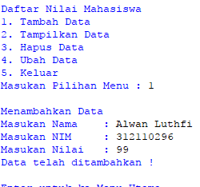
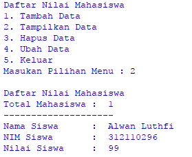
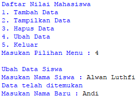
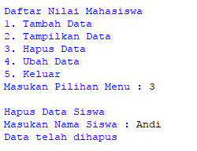
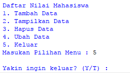

# labspy07
## Berikut adalah kode saya
datasiswa = []
pilih = 0

class Person():
    def __init__(self, nama, nim, nilai):
        self.nama = nama
        self.nim = nim
        self.nilai = nilai

    def cetak(self):
        print(f"Nama Siswa\t: ", self.nama)
        print(f"NIM Siswa\t: ", self.nim)
        print(f"Nilai Siswa\t: ", self.nilai)
        print("~~~")

def menu():
    print("Daftar Nilai Mahasiswa")
    print("1. Tambah Data")
    print("2. Tampilkan Data")
    print("3. Hapus Data")
    print("4. Ubah Data")
    print("5. Keluar")
    pilih = int(input("Masukan Pilihan Menu : "))
    print()
    if pilih == 1:
        tambah()
    elif pilih == 2:
        tampilkan()
    elif pilih == 3:
        hapus()
    elif pilih == 4:
        ubah()
    elif pilih == 5:
        keluar()
    else:
        print("Input Menu Salah !")
        print()
        input("Enter untuk ke Menu Utama. . .")
        print()
        menu()

def tambah():
    print("Menambahkan Data")
    nama = input("Masukan Nama\t: ")
    nim = input("Masukan NIM\t: ")
    nilai = input("Masukan Nilai\t: ")
    datasiswa.append({
        "nama" : nama,
        "nim" : nim,
        "nilai" : nilai
        })
    print("Data telah ditambahkan !")
    print()
    input("Enter untuk ke Menu Utama. . .")
    print()
    menu()

def tampilkan():
    if len(datasiswa) == 0:
        print("Tidak Ada Data !")
        print("Tambah data dahulu sebelum membuka menu ini !")
    else:
        print("Daftar Nilai Mahasiswa")
        print("Total Mahasiswa : ",len(datasiswa))
        print("-"*20)

        
        for item in datasiswa:
            test1 = item["nama"]
            test2 = item["nim"]
            test3 = item["nilai"]
            cetakdenganclass = Person(test1, test2, test3)
            cetakdenganclass.cetak()
            
    print()
    input("Enter untuk ke Menu Utama. . .")
    print()
    menu()
            
def hapus():
    if len(datasiswa) == 0:
        print("Tidak Ada Data !")
        print("Tambah data dahulu sebelum membuka menu ini !")
    else:
        print("Hapus Data Siswa")
        for i in range(len(datasiswa)):
            id_hapus = input("Masukan Nama Siswa : ")
            if id_hapus == datasiswa[i]["nama"]:
                del datasiswa[i]
                print("Data telah dihapus")
                break
            else:
                print("data tidak di temukan")
                break
    print()
    input("Enter untuk ke Menu Utama. . .")
    print()
    menu()

def ubah():
    if len(datasiswa) == 0:
        print("Tidak Ada Data !")
        print("Tambah data dahulu sebelum membuka menu ini !")
    else: 
        print("Ubah Data Siswa")
        for i in range(len(datasiswa)):
            id_ubah = input("Masukan Nama Siswa : ")
            if id_ubah == datasiswa[i]["nama"]:
                print("Data telah ditemukan")
                id_tambah = input("Masukan Nama Baru : ")
                print()
                datasiswa[i]["nama"] = id_tambah
                print("Data telah diubah")
                break
            else:
                print("data tidak di temukan")
    print()
    input("Enter untuk ke Menu Utama. . .")
    print()
    menu()

def keluar():
    keluar = input("Yakin ingin keluar? (Y/T) : ")
    if keluar == "y" or keluar == "Y":
        exit()
    else:
        menu()
        print()
menu()

ini adalah kode dari pertemuan 11,tetapi saya tambahkan dari materi baru pertemuan 12
class Person():
    def __init__(self, nama, nim, nilai):
        self.nama = nama
        self.nim = nim
        self.nilai = nilai

    def cetak(self):
        print(f"Nama Siswa\t: ", self.nama)
        print(f"NIM Siswa\t: ", self.nim)
        print(f"Nilai Siswa\t: ", self.nilai)
        print("~~~")

## Output fungsi tambah

## Output fungsi tampilkan

## Output fungsi ubah

## Output fungsi hapus

## Output fungsi keluar

## SELESAI